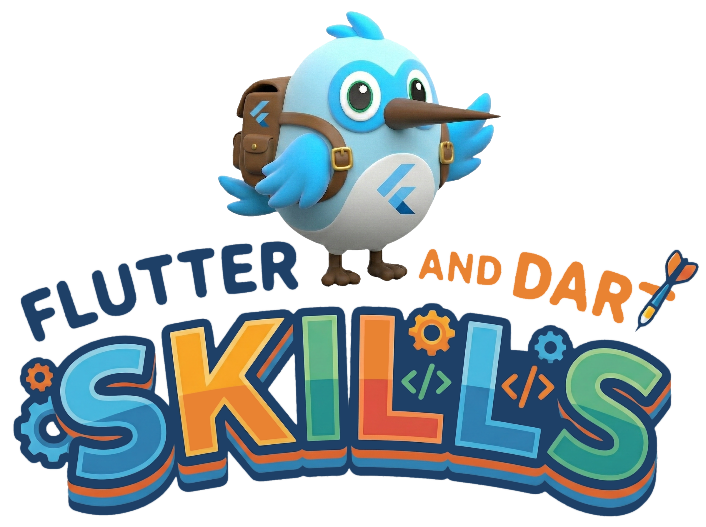

  
   
  
  
  

# Dash Skills

A curated collection of "skills" for AI agents working on [Dart](https://dart.dev)
and [Flutter](https://flutter.dev) projects. These skills follow the
[Agent Skills](https://agentskills.io/) standard, enabling agents to perform
complex specialized tasks with high reliability.

## 🧠 Available Skills

| Skill | Description | Key Features |
|-------|-------------|--------------|
| **[Dart Checks Migration](.agent/skills/dart-checks-migration/SKILL.md)** | Migrate from `package:matcher` to `package:checks`. | Automated conversion patterns for modern testing. |
| **[Dart CLI Best Practices](.agent/skills/dart-cli-app-best-practices/SKILL.md)** | Create high-quality executable CLI apps. | Entrypoint structure, exit codes, cross-platform scripts. |
| **[Dart Matcher Best Practices](.agent/skills/dart-matcher-best-practices/SKILL.md)** | Best practices for `expect` and `package:matcher`. | Async matching, collection matchers, `isA` chaining. |
| **[Dart Package Maintenance](.agent/skills/dart-package-maintenance/SKILL.md)** | Guidelines for package maintenance. | Versioning, WIP tracking, and publishing workflows. |
| **[Dart Test Fundamentals](.agent/skills/dart-test-fundamentals/SKILL.md)** | Core concepts for `package:test`. | `test`/`group` structure, lifecycle, configuration. |
| **[pub.dev Search](.agent/skills/pub-dev-search/SKILL.md)** | Search pub.dev and recommend packages. | Quality scores, popularity, likes, downloads, recency. |

## 🚀 Usage

To use these skills with an agent (like [AntiGravity](https://antigravity.google)
or [Gemini CLI](https://github.com/google/gemini-cli)):

1.  **Ingest**: The agent reads the `.agent/skills` directory.
2.  **Activate**: Each skill contains a `SKILL.md` defining when and how it should be used.
3.  **Execute**: The agent follows the structured workflows and patterns defined in the skill files.

## 🛠️ Contributing

1.  Create a new directory in `.agent/skills/`.
2.  Add a `SKILL.md` with the required frontmatter.
3.  Include any necessary scripts or resources.

---

_Learn more at [agentskills.io](https://agentskills.io/)_
